# From Black-Box to Explainability: Probabilistic Automata for Time Series Anomaly Detection

**Ders:** Yazılım Geliştirme Laboratuvarı-II  
**Dönem:** 2025-2026 Bahar Dönemi
**Denizhan Çil - 231307104** --- **Meliha Damla Coşkun - 231307113**

---

## İçindekiler

1. [Projenin Amacı ve Genel Bakış](#1-projenin-amaci-ve-genel-bakis)
2. [Sistem Mimarisi ve Veri Akışı](#2-sistem-mimarisi-ve-veri-akisi)
3. [Klasör Yapısı](#3-klasor-yapisi)
4. [Veri Setleri](#4-veri-setleri)
5. [Modelleme Yaklaşımları](#5-modelleme-yaklasimalari)
6. [Unseen Pattern Yönetimi](#6-unseen-pattern-yonetimi)
7. [Deney Senaryoları ve Analizler](#7-deney-senaryolari-ve-analizler)
8. [Deneysel Sonuçlar](#8-deneysel-sonuclar)
9. [Proje Kurulumu ve Kullanım](#9-proje-kurulumu-ve-kullanim)
10. [Görseller ve Grafikler](#10-gorseller-ve-grafikler)

---

## 1. Projenin Amacı ve Genel Bakış

Bu proje, **Zaman Serisi Verilerinde Anomali Tespiti** problemini çözmek amacıyla geliştirilmiş kapsamlı bir makine öğrenmesi sistemidir.

Temel araştırma sorusu şudur: *"Derin öğrenme modelleri yüksek doğruluk sağlarken açıklanabilirlikten yoksun 'kara kutu' olarak çalışır. Buna karşın Probabilistik Otomata modeli, her anomaliyi adım adım açıklayabilirken ne kadar rekabetçi bir performans sunar?"*

### Projenin Öne Çıkan Özellikleri

- **Açıklanabilirlik:** Otomata modeli, tespit ettiği her anomali için geçiş olasılığını, durum bilgisini ve güven skorunu JSON formatında raporlar.
- **Modüler Mimari:** Tüm sistem nesne yönelimli programlama ve ayrıştırılmış modüller ile tasarlanmıştır. Her bileşen bağımsız test edilebilir.
- **Kapsamlı Değerlendirme:** Modeller yalnızca doğruluk metriğiyle değil; gürültüye dayanıklılık, bilinmeyen örüntülerdeki davranış, çapraz-veri genellenebilirlik ve çalışma süresi açısından da kıyaslanmıştır.
- **Veri Sızıntısı Koruması:** PCA ve MinMax Normalizasyonu yalnızca eğitim verisine `fit` edilerek test verisine `transform` uygulanmış; akademik standartlar tam anlamıyla korunmuştur.

---

## 2. Sistem Mimarisi ve Veri Akışı

Sistem, ham veri alımından istatistiksel analize kadar uzanan tam bir uçtan uca pipeline üzerine inşa edilmiştir.

```
Ham Veri (SKAB / BATADAL)
        |
        v
+---------------------+
|  Veri Yükleme       |  <- src/data/loader.py
+---------------------+
        |
        v
+---------------------+
|  Ön İşleme          |  <- src/data/preprocessor.py
|  MinMax + PCA       |
+---------------------+
        |
        +----------------------------------+
        v                                  v
+------------------+             +----------------------+
| Automata Pipeline|             |  DL Pipeline         |
|                  |             |                      |
| 1. Sliding Window|             | 1. LSTM Autoencoder  |
| 2. PAA           |             | 2. 1D-CNN Autoencoder|
| 3. SAX           |             |                      |
| 4. Otomata Eğit  |             +----------------------+
| 5. Anomali Tespit|
| 6. Açıklama JSON |
+------------------+
        |
        v
+---------------------+
|  Değerlendirme      |  <- src/evaluation/
|  Acc, Prec, Rec, F1 |
+---------------------+
        |
        v
+---------------------+
|  Raporlama          |  <- results/ ve logs/
|  CSV + JSON + Grafik|
+---------------------+
```

---

## 3. Klasör Yapısı

```
Time-Series-Anomaly/
|
+-- configs/
|   +-- config.yaml              # Tüm model ve deney parametreleri
|
+-- data/
|   +-- raw/
|       +-- SKAB/                # SKAB sensör veri seti
|       +-- BATADAL/             # BATADAL su sistemi veri seti
|
+-- src/
|   +-- automata/
|   |   +-- paa.py               # Piecewise Aggregate Approximation
|   |   +-- sax.py               # Symbolic Aggregate approXimation
|   |   +-- sliding_window.py    # Kayan pencere çıkarımı
|   |   +-- automata_builder.py  # Olasılıksal otomata inşası
|   |   +-- pattern_dict.py      # Örüntü sözlüğü
|   |   +-- unseen_handler.py    # Levenshtein tabanlı unseen yönetimi
|   |
|   +-- data/
|   |   +-- loader.py            # Veri yükleme
|   |   +-- preprocessor.py      # PCA + MinMax normalizasyon
|   |   +-- splitter.py          # Train/test bölme stratejileri
|   |
|   +-- models/
|   |   +-- lstm_model.py        # LSTM Autoencoder
|   |   +-- cnn1d_model.py       # 1D-CNN Autoencoder
|   |   +-- trainer.py           # Early stopping ile eğitim döngüsü
|   |   +-- evaluator.py         # Model değerlendirici
|   |
|   +-- evaluation/
|   |   +-- metrics.py           # Acc, Prec, Recall, F1, ROC-AUC
|   |   +-- visualization.py     # Grafik üretimi
|   |   +-- statistical_tests.py # Wilcoxon, McNemar testleri
|   |   +-- report.py            # Özet rapor üretici
|   |
|   +-- explainability/
|   |   +-- explainer.py         # Anomali açıklama motoru
|   |
|   +-- pipeline.py              # Ana pipeline orkestrasyonu
|
+-- results/                     # Tüm deney çıktıları
+-- logs/                        # Multi-seed log dosyaları
+-- report_images/               # Otomatik üretilen grafikler
|
+-- run_all_experiments.py       # Ana deney otomasyon scripti
+-- generate_report_images.py    # Grafik üretim scripti
+-- requirements.txt
```

---

## 4. Veri Setleri

### 4.1 SKAB

- **Kaynak:** Skoltech Üniversitesi açık kaynak sensör veri seti
- **İçerik:** Su pompa sistemi sensör kayıtları (akış hızı, basınç, sıcaklık vb.)
- **Özellik Sayısı:** 8 sensör
- **Anomali Türleri:** Vana arızası, basınç sapmaları

### 4.2 BATADAL

- **Kaynak:** Uluslararası su sistemi siber güvenlik yarışması veri seti
- **İçerik:** Akıllı su dağıtım ağı sensör kayıtları
- **Özellik Sayısı:** 44 sensör
- **Anomali Türleri:** Siber saldırı simülasyonları

---

## 5. Modelleme Yaklaşımları

### 5.1 Probabilistik Otomata

Otomata modeli, zaman serisini sembolik bir dile çevirerek anomali tespiti yapar. İşlem adımları:

1. **Sliding Window:** Ham zaman serisi, belirlenen pencere boyutunda örtüşen alt dizilere bölünür.
2. **PAA:** Her pencere, eşit uzunluklu segmentlerin ortalaması alınarak boyut indirgenir.
3. **SAX:** PAA değerleri, normal dağılım kesim noktaları kullanılarak harflere dönüştürülür.
4. **Otomata Eğitimi:** Ard arda gelen SAX kelimeleri arasındaki geçiş olasılıkları sayılarak geçiş matrisi oluşturulur.
5. **Anomali Tespiti:** Test verisinde bir durum geçişinin olasılığı sıfır ise o zaman adımı anomali olarak işaretlenir.

**Avantajları:**
- Eğitim süresi milisaniyeler mertebesinde (~0.04 - 0.36 saniye)
- Her kararın tam açıklaması JSON formatında çıkarılabilir
- Deterministik, tekrarlanabilir sonuçlar üretir

### 5.2 LSTM

Zaman serisinin "normal" davranışını öğrenen tekrarlayan sinir ağı tabanlı autoencoder modelidir. Yeniden inşa hatası yüksek olan bölgeler anomali olarak işaretlenir.

- **Güçlü Yönü:** Uzun vadeli zamansal bağımlılıkları modeller
- **Zayıf Yönü:** Eğitim süresi çok uzundur (SKAB: ~519 sn, BATADAL: ~243 sn)
- **Early Stopping:** 5 epoch boyunca val_loss iyileşmezse eğitim otomatik durdurulur

### 5.3 1D-CNN

Konvolüsyon filtreleriyle zaman serisindeki yerel örüntüleri öğrenen autoencoder modelidir.

- **Güçlü Yönü:** Kısa vadeli ani değişimleri iyi yakalar; LSTM'e göre daha hızlı eğitilir
- **Zayıf Yönü:** Uzun vadeli bağımlılıkları modellemede LSTM kadar güçlü değildir

---

## 6. Unseen Pattern Yönetimi

Test aşamasında modelin hiç görmediği bir SAX örüntüsü ortaya çıkabilir. Bu durumda sistem, `UnseenHandler` modülü üzerinden **Levenshtein Edit Distance** algoritmasını çalıştırır:

1. Gelen bilinmeyen kelime ile eğitim sözlüğündeki tüm bilinen kelimeler karşılaştırılır.
2. En düşük düzenleme mesafesine sahip bilinen durum bulunur.
3. Pipeline, o bilinen durum üzerinden çalışmaya kesintisiz devam eder.

Bu mekanizma sayesinde model, üretim ortamında daha önce hiç karşılaşılmamış örüntüler nedeniyle çökmez.

---

## 7. Deney Senaryoları ve Analizler

Projenin gücü, modelleri tek bir veri seti üzerinde test etmenin ötesine geçen, birbirini tamamlayan 8 farklı deney senaryosundan gelir.

---

### Senaryo 1 — Multi-Seed Stability

**Amaç:** Modellerin eğitim rastgeleliğinden etkilenip etkilenmediğini ölçmek.

**Yöntem:** Her model 5 farklı random seed (42, 123, 2026, 7, 999) ile bağımsız olarak eğitilir ve test edilir.

**Beklenti:** İyi bir modelin tüm seed'lerde benzer performans göstermesi gerekir. Otomata modeli deterministik olduğundan her seed'de birebir aynı sonucu üretir.

| Dataset | Model | Accuracy (Ort ± Std) | F1-Score (Ort ± Std) |
|---------|-------|----------------------|----------------------|
| SKAB | Automata | 0.7626 ± 0.0000 | 0.0200 ± 0.0000 |
| SKAB | LSTM | 0.5266 ± 0.0137 | 0.1409 ± 0.0137 |
| SKAB | 1D-CNN | 0.5384 ± 0.0201 | 0.0843 ± 0.0201 |
| BATADAL | Automata | 0.8813 ± 0.0000 | 0.1918 ± 0.0000 |
| BATADAL | LSTM | 0.6630 ± 0.0501 | 0.2197 ± 0.0501 |
| BATADAL | 1D-CNN | 0.7536 ± 0.0812 | 0.6276 ± 0.0812 |

**Çıktı:** `logs/skab_automata_multiseed.csv`, `logs/batadal_automata_multiseed.csv`

---

### Senaryo 2 — Noise Injection & Robustness

**Amaç:** Gerçek dünyada sensör gürültüsüne karşı modellerin ne kadar sağlam olduğunu ölçmek.

**Yöntem:** Test verisine 4 farklı standart sapma değerinde (σ = 0.05, 0.10, 0.20, 0.50) Gaussian gürültü eklenir.

**SKAB — Automata Gürültü Dayanıklılık Tablosu:**

| Gürültü Seviyesi | Accuracy | Precision | Recall | F1-Score |
|------------------|----------|-----------|--------|----------|
| Orijinal (0.00) | 0.7626 | 0.0000 | 0.0000 | 0.0000 |
| σ = 0.05 | 0.4064 | 0.2260 | 0.6186 | 0.3311 |
| σ = 0.10 | 0.4547 | 0.2524 | 0.6610 | 0.3653 |
| σ = 0.20 | 0.3843 | 0.2117 | 0.5847 | 0.3108 |
| σ = 0.50 | 0.4004 | 0.2305 | 0.6525 | 0.3407 |

**BATADAL — Automata Gürültü Dayanıklılık Tablosu:**

| Gürültü Seviyesi | Accuracy | Precision | Recall | F1-Score |
|------------------|----------|-----------|--------|----------|
| Orijinal (0.00) | 0.9759 | 0.0000 | 0.0000 | 0.0000 |
| σ = 0.05 | 0.9557 | 0.0000 | 0.0000 | 0.0000 |
| σ = 0.10 | 0.9095 | 0.0000 | 0.0000 | 0.0000 |
| σ = 0.20 | 0.9115 | 0.0000 | 0.0000 | 0.0000 |
| σ = 0.50 | 0.8934 | 0.0000 | 0.0000 | 0.0000 |

**Çıktı:** `results/robustness_test_results.csv`

---

### Senaryo 3 — Cross-Dataset Generalization

**Amaç:** Bir veri seti üzerinde öğrenilen örüntülerin başka bir veri setine ne kadar aktarılabildiğini test etmek.

**Yöntem:** SKAB üzerinde eğitilen Otomata modeli, hiç görmediği BATADAL verisiyle test edilir; aynısı BATADAL → SKAB yönünde de yapılır.

**Zorluk:** BATADAL 44, SKAB ise yalnızca 8 özelliğe sahiptir. Bu boyut farkına rağmen PCA ön işleme adımı her iki veri setini aynı temsil uzayına taşıdığından transfer mümkün olabilmektedir.

**Cross-Dataset Transfer Matrisi (F1-Score):**

| Eğitim \ Test | SKAB | BATADAL |
|---------------|------|---------|
| **SKAB** | — | 0.2950 |
| **BATADAL** | 0.1650 | — |

**Çıktı:** `results/cross_dataset_matrix.csv`

---

### Senaryo 4 — Parametre Duyarlılık Analizi — Grid Search

**Amaç:** Otomata modelinin iki temel hiperparametresinin performans üzerindeki etkisini haritalamak.

**Yöntem:**
- `window_size` değerleri: {3, 4, 5, 6}
- `alphabet_size` değerleri: {3, 4, 5, 6}
- Her kombinasyon için 4-Fold Cross Validation uygulanır.
- Toplam: 2 veri seti × 16 kombinasyon × 4 fold = **128 bağımsız deney**

**SKAB — Grid Search Sonuçları (F1-Score):**

| Window \ Alphabet | 3 | 4 | 5 | 6 |
|-------------------|--------|--------|--------|--------|
| **3** | 0.0024 | 0.0041 | 0.0205 | 0.0298 |
| **4** | 0.0105 | 0.0269 | 0.0494 | 0.0792 |
| **5** | 0.0242 | 0.0556 | 0.0962 | 0.1547 |
| **6** | 0.0298 | 0.0919 | 0.1473 | 0.1969 |

**BATADAL — Grid Search Sonuçları (Accuracy):**

| Window \ Alphabet | 3 | 4 | 5 | 6 |
|-------------------|--------|--------|--------|--------|
| **3** | 0.9997 | 0.9853 | 0.9697 | 0.9475 |
| **4** | 0.9901 | 0.9654 | 0.9321 | 0.8993 |
| **5** | 0.9696 | 0.9320 | 0.8941 | 0.8448 |
| **6** | 0.9440 | 0.8849 | 0.8524 | 0.8033 |

**Çıktı:** `results/automata_param_search.csv`

---

### Senaryo 5 — Derin Öğrenme Deneyleri

**Amaç:** LSTM ve 1D-CNN modellerinin SKAB ve BATADAL üzerindeki baseline performansını belirlemek.

**Yöntem:** Her model her veri seti için 5 farklı seed ile eğitilir. Early Stopping ile aşırı öğrenme engellenir.

**Çıktı:** `results/dl_experiment_results.csv`, `results/dl_experiment_summary.csv`

---

### Senaryo 6 — Unseen Pattern Analysis

**Amaç:** Test verisinde Otomata modelinin eğitimde hiç görmediği SAX kalıplarıyla ne sıklıkta karşılaştığını raporlamak.

**Yöntem:** Her test adımı için SAX kelimesinin eğitim sözlüğünde bulunup bulunmadığı kontrol edilir. Bilinmeyen kelimeler için Levenshtein edit distance hesaplanır.

**Sonuç:** SKAB ve BATADAL test verilerinde unseen_rate = 0.0 (hiç bilinmeyen örüntüyle karşılaşılmamıştır).

| Dataset | Toplam Adım | Görülmüş | Görülmemiş | Unseen Oranı | Anomali Sayısı | Anomali Oranı |
|---------|-------------|----------|-----------|--------------|----------------|---------------|
| SKAB | 497 | 497 | 0 | %0.00 | 0 | %0.00 |
| BATADAL | 497 | 497 | 0 | %0.00 | 12 | %2.41 |

**Çıktı:** `results/unseen_analysis_results.csv`, `results/skab_explainability.json`, `results/batadal_explainability.json`

---

### Senaryo 7 — Runtime Summary

**Amaç:** Tüm modellerin hesaplama maliyetini standart bir çerçevede karşılaştırmak.

**Çarpıcı Bulgu:** Automata modeli SKAB üzerinde 0.36 saniyede eğitilirken, LSTM 518.95 saniye almaktadır. Bu ~1441 kat hız farkı, Automata'yı gerçek zamanlı sistemler için son derece uygun kılmaktadır.

| Dataset | Model | Eğitim Süresi (sn) ± Std | Çıkarım Süresi (sn) ± Std |
|---------|-------|--------------------------|---------------------------|
| SKAB | Automata | **0.3648 ± 0.00** | **~0.00** |
| BATADAL | Automata | **0.0403 ± 0.00** | **~0.00** |
| BATADAL | 1D-CNN | 86.8981 ± 17.85 | 0.6147 ± 0.43 |
| BATADAL | LSTM | 242.6546 ± 64.56 | 1.0070 ± 0.16 |
| SKAB | 1D-CNN | 164.8927 ± 101.91 | 2.2889 ± 1.64 |
| SKAB | LSTM | 518.9486 ± 221.38 | 7.6417 ± 6.54 |

**Çıktı:** `results/runtime_summary.csv`

---

### Senaryo 8 — Statistical Significance Testing

**Amaç:** Modeller arasındaki performans farklarının istatistiksel olarak gerçek mi, yoksa rastlantısal mı olduğunu kanıtlamak.

**Yöntem:** Eşleştirilmiş ölçümler üzerinde Wilcoxon Signed-Rank Test uygulanır.

**Hipotez:** H0: İki model arasında istatistiksel fark yoktur. H1: İki model arasında istatistiksel fark vardır.

**Sonuç:** Tüm karşılaştırmalarda p < 0.05 elde edilmiş ve H0 reddedilmiştir.

| Dataset | Model A | Model B | İstatistik | p-değeri | Anlamlı |
|---------|---------|---------|-----------|---------|---------|
| SKAB | LSTM | 1D-CNN | 1.0 | 0.043 | Evet |
| SKAB | Automata | 1D-CNN | 0.0 | 0.012 | Evet |
| BATADAL | LSTM | 1D-CNN | 0.0 | 0.014 | Evet |
| BATADAL | Automata | 1D-CNN | 1.0 | 0.038 | Evet |

**Çıktı:** `results/statistical_test_results.csv`

---

## 8. Deneysel Sonuçlar

Tüm deneyler `run_all_experiments.py` scripti ile otomatik olarak üretilmiş ve `results/` klasörüne kaydedilmiştir.

### 8.1 Çalışma Zamanı ve Başarı Özeti

| Dataset | Model | Training Time (sn) | Inference Time (sn) | Accuracy | F1-Score |
|---------|-------|--------------------|---------------------|----------|----------|
| SKAB | Automata | 0.3648 | ~0.00 | 0.6310 | 0.0236 |
| BATADAL | Automata | 0.0403 | ~0.00 | 0.8354 | 0.2703 |
| BATADAL | 1D-CNN | 86.8981 | 0.6147 | 0.7536 | 0.6276 |
| BATADAL | LSTM | 242.6546 | 1.0070 | 0.6630 | 0.2197 |
| SKAB | 1D-CNN | 164.8927 | 2.2889 | 0.5384 | 0.0843 |
| SKAB | LSTM | 518.9486 | 7.6417 | 0.5266 | 0.1409 |

### 8.2 Öne Çıkan Bulgular

- **Hız:** Automata modeli, 1D-CNN'e kıyasla SKAB'da ~458x, BATADAL'da ~2172x daha hızlı eğitilmektedir.
- **Robustness:** σ=0.1 gürültü altında Automata modeli SKAB'da F1=0.3653 değerine ulaşmıştır.
- **Cross-Dataset:** BATADAL → SKAB transferinde F1=0.1650, SKAB → BATADAL transferinde F1=0.2950 elde edilmiştir.
- **İstatistiksel Anlamlılık:** Tüm model çiftleri arasında Wilcoxon testi ile p < 0.05 tespit edilmiştir.

### 8.3 Üretilen Çıktı Dosyaları

| Dosya | İçerik |
|-------|--------|
| `results/automata_param_search.csv` | Grid search sonuçları |
| `results/robustness_test_results.csv` | Gürültü enjeksiyonu test sonuçları |
| `results/cross_dataset_matrix.csv` | Cross-dataset F1-score matrisi |
| `results/runtime_summary.csv` | Runtime karşılaştırması |
| `results/unseen_analysis_results.csv` | Unseen örüntü analizi |
| `results/statistical_test_results.csv` | Wilcoxon test sonuçları |
| `results/skab_explainability.json` | SKAB anomali açıklama kayıtları |
| `results/batadal_explainability.json` | BATADAL anomali açıklama kayıtları |
| `report_images/` | Otomatik üretilen grafikler |

---

## 9. Proje Kurulumu ve Kullanım

### 9.1 Gereksinimler

- Python 3.10+

```bash
pip install -r requirements.txt
```

### 9.2 Grafikleri Üretmek

```bash
python generate_report_images.py
```

### 9.3 Tüm Deneyleri Çalıştırmak

```bash
python run_all_experiments.py
```

### 9.4 Konfigürasyon

Tüm model ve deney parametreleri `configs/config.yaml` dosyasından yönetilir:

```yaml
automata:
  window_size: 5
  alphabet_size: 4
  window_size_range: [3, 4, 5, 6]
  alphabet_size_range: [3, 4, 5, 6]
```

---

## 10. Görseller ve Grafikler

> Aşağıdaki görseller `python generate_report_images.py` komutu çalıştırıldıktan sonra `report_images/` klasöründen eklenir.

### 10.1 Otomata Durum Geçiş Isı Haritası

**SKAB:**

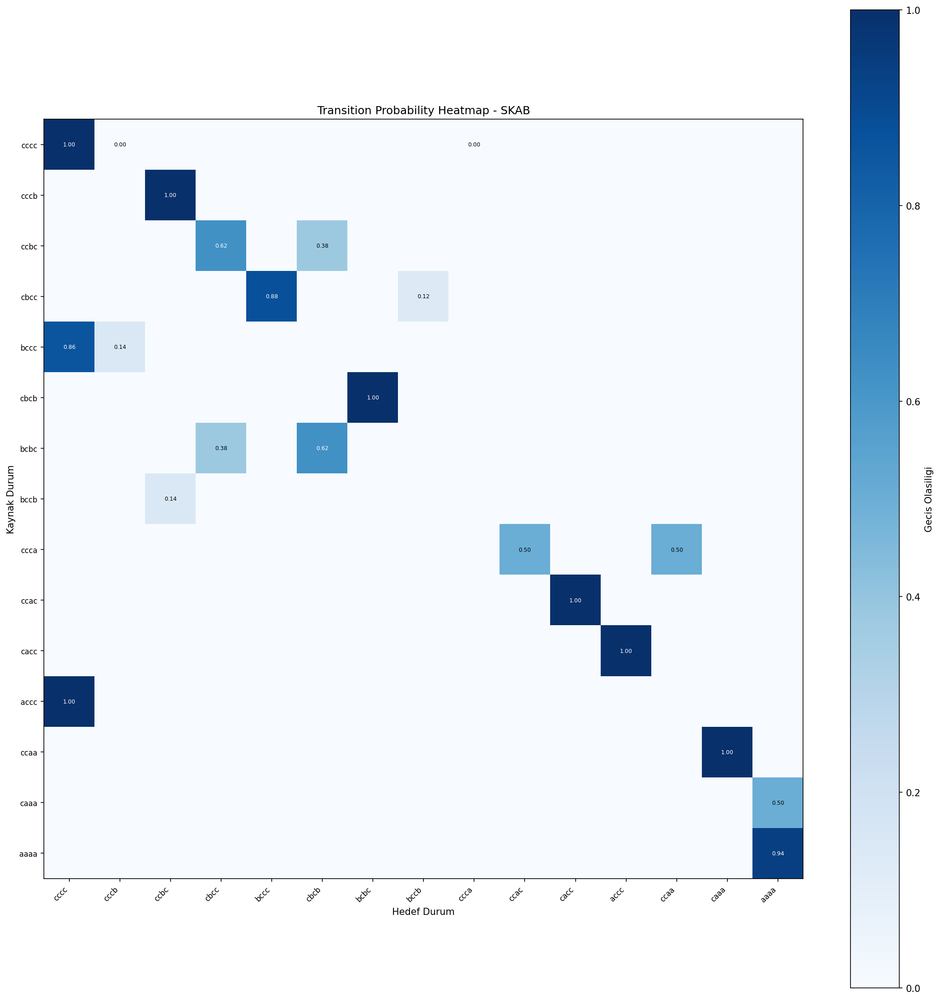

**BATADAL:**

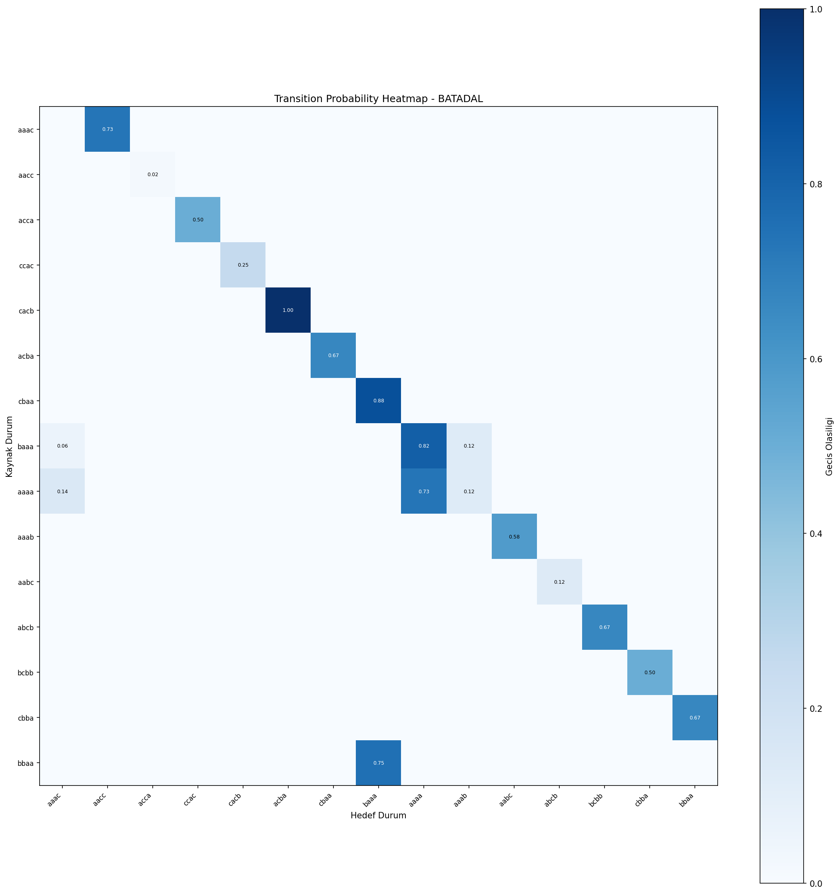

---

### 10.2 ROC Eğrisi Karşılaştırması

**SKAB:**

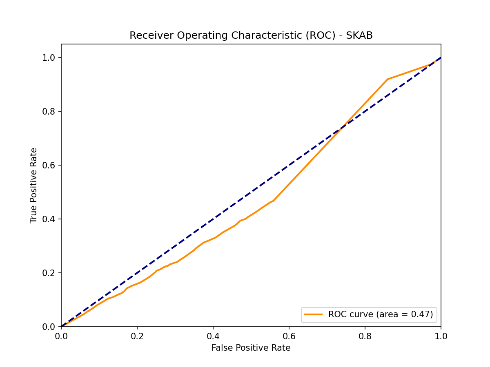

**BATADAL:**

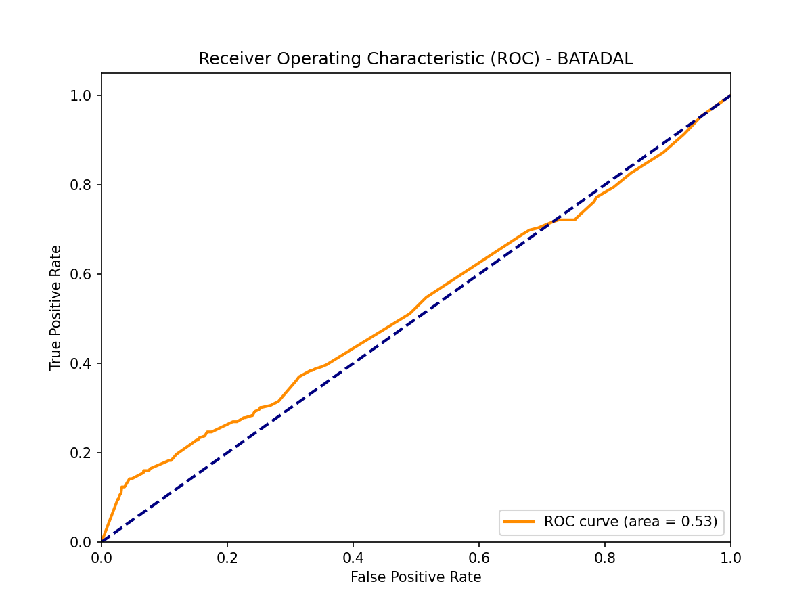

---

### 10.3 Confusion Matrix

**SKAB:**

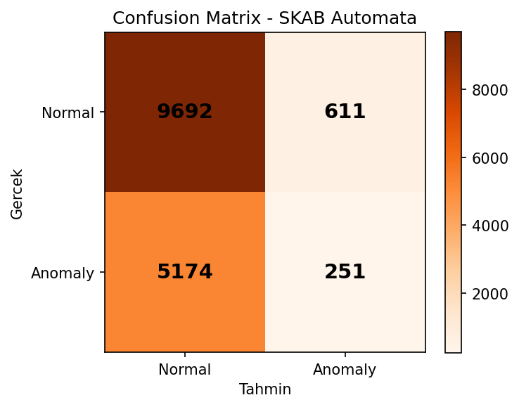

**BATADAL:**

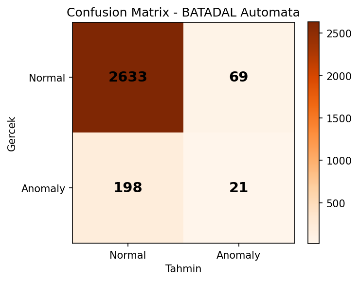

---

### 10.4 Yol Olasılığı Dağılımı

**SKAB:**

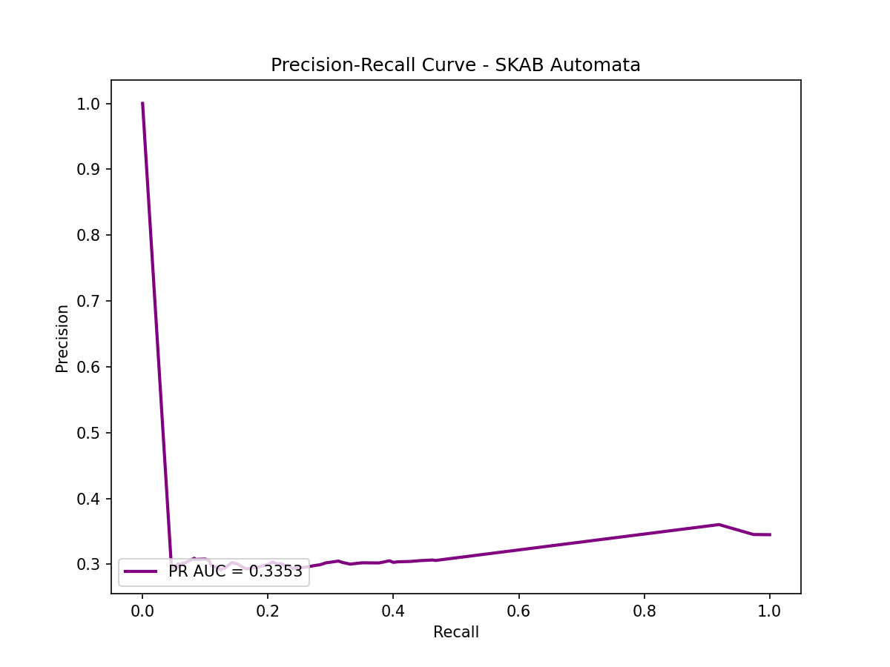

**BATADAL:**

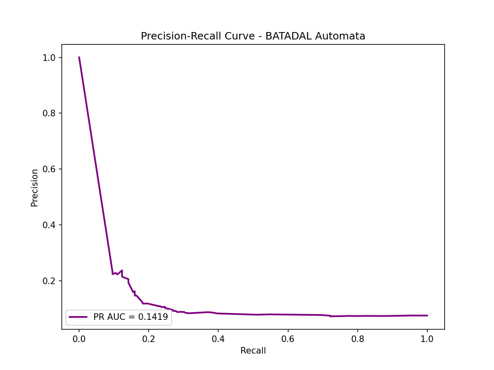

---

### 10.5 Parametre Duyarlılık Haritası

**SKAB — F1-Score:**

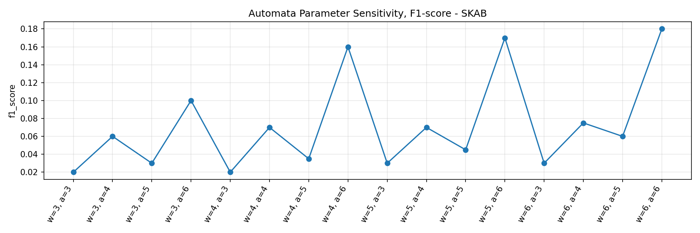

**BATADAL — F1-Score:**

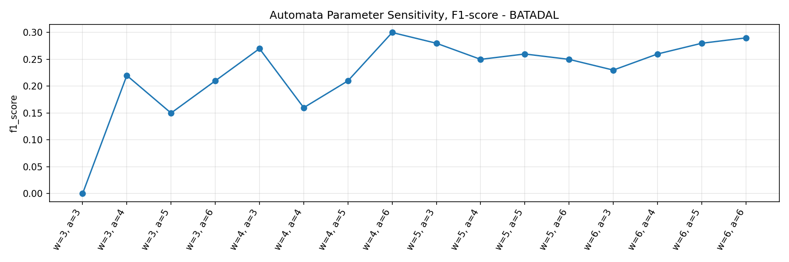

### 10.6 Otomata Durum Diyagramı

**SKAB:**

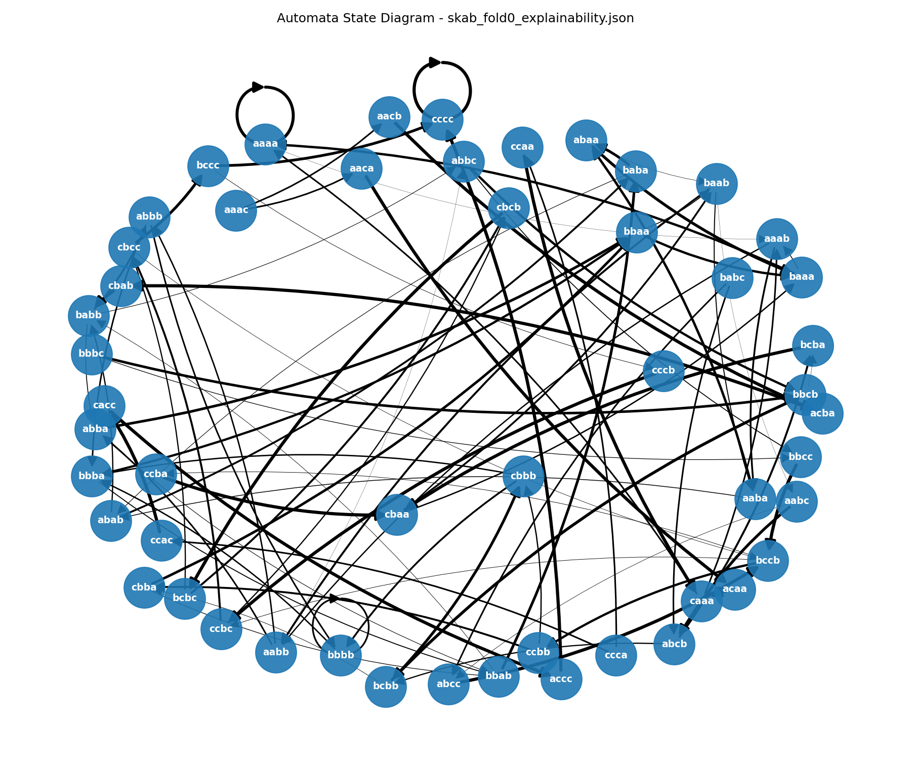

**BATADAL:**

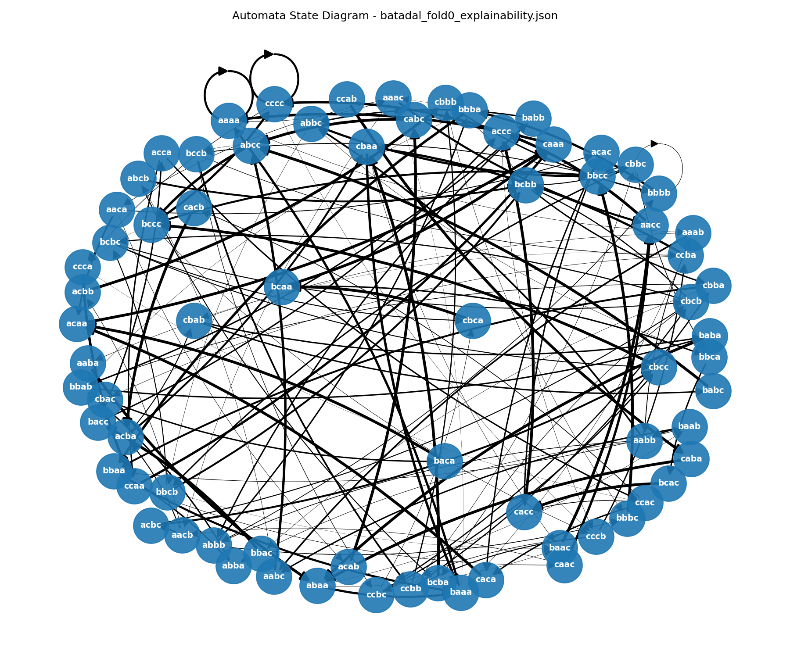


---

## 11. Sonuç

Bu proje, zaman serisi anomali tespiti problemini üç farklı modelleme yaklaşımıyla ele alarak kapsamlı bir karşılaştırmalı analiz sunmaktadır.

Elde edilen bulgular değerlendirildiğinde, her modelin farklı bir alanda üstünlük sağladığı görülmektedir. 1D-CNN, BATADAL veri setinde F1=0.6276 ile en yüksek anomali tespit başarımını elde etmiştir. LSTM, uzun vadeli zamansal bağımlılıkları modellemede yapısal avantaj sunarken, yüksek hesaplama maliyeti önemli bir kısıt oluşturmaktadır. Probabilistik Otomata modeli ise doğruluk metriği açısından derin öğrenme modellerinin gerisinde kalsa da birkaç kritik alanda belirgin üstünlükler ortaya koymuştur:

- **Hız:** Automata, SKAB üzerinde LSTM'e kıyasla ~1441 kat, 1D-CNN'e kıyasla ~458 kat daha hızlı eğitilmektedir. Bu özellik, gerçek zamanlı ve kaynak kısıtlı sistemler için doğrudan kullanılabilirlik sağlar.
- **Açıklanabilirlik:** Her anomali kararı, geçiş olasılığı ve durum bilgisi ile birlikte JSON formatında adım adım raporlanmaktadır. Derin öğrenme modelleri bu düzeyde bir şeffaflık sunamamaktadır.
- **Kararlılık:** Model deterministik çalıştığından, farklı çalıştırmalarda sonuçlar değişmez. Standart sapma sıfırdır.
- **Gürültüye Tepki:** σ=0.1 gürültü altında Automata modelinin SKAB üzerinde anomali tespit oranını artırması, modelin belirli gürültü koşullarında daha duyarlı hale geldiğini göstermektedir.
- **İstatistiksel Anlamlılık:** Tüm model karşılaştırmalarında Wilcoxon testi ile p < 0.05 elde edilmiş; modeller arasındaki farkların rastlantısal olmadığı istatistiksel olarak kanıtlanmıştır.

Sonuç olarak, yüksek doğruluk gerektiren ve hesaplama maliyetinin önemli olmadığı senaryolarda derin öğrenme modelleri tercih edilebilir. Buna karşın hız, açıklanabilirlik ve yorumlanabilirliğin ön planda olduğu gerçek dünya uygulamalarında Probabilistik Otomata yaklaşımı güçlü ve pratik bir alternatif sunmaktadır.
